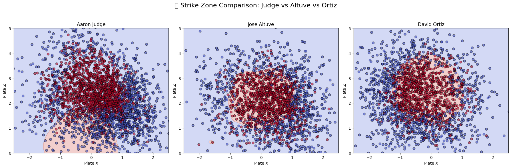

# ⚾️ Strike Zone Classifier – MLB Pitch Classification with Machine Learning

This project builds a machine learning model that predicts whether a baseball pitch is a **strike or ball** based on its **location** over home plate. We use real pitch-by-pitch data for **Aaron Judge**, **Jose Altuve**, and **David Ortiz** to learn **personalized strike zones** using **Support Vector Machines (SVM)**.

---

## 🔍 Problem Statement

Umpire strike zones vary from person to person. This project leverages MLB pitch data to:
- Model a **consistent, player-specific** decision boundary
- Visualize **individual strike zones**
- Apply a complete **end-to-end ML pipeline**

---

## 🧠 Machine Learning Workflow

✅ Load MLB pitch data from [pybaseball](https://github.com/jldbc/pybaseball)  
✅ Clean and filter features (`plate_x`, `plate_z`, `type`)  
✅ Encode labels (`S` → 1, `B` → 0)  
✅ Train Support Vector Machine (SVC with RBF kernel)  
✅ Perform hyperparameter tuning with `GridSearchCV`  
✅ Build a reusable `Pipeline` with `StandardScaler`  
✅ Visualize learned strike zones for each player  
✅ Compare visually in a side-by-side plot

---

## 🛠️ Tools & Libraries

- Python + Jupyter Notebook (Google Colab)
- [pybaseball](https://github.com/jldbc/pybaseball) – pitch-by-pitch data
- `scikit-learn` – SVM, GridSearchCV, Pipelines
- `matplotlib` – custom strike zone plots
- `pandas`, `numpy` – data wrangling

---

## 📈 Results

- Achieved **~85% accuracy** on validation set
- Visualized **player-specific strike zones**
- Used **Grid Search** to find best `C` and `gamma`
- Built a pipeline for deployment-ready modeling

---

## 📷 Final Visualization

### ⚾️ Strike Zone Comparison: Judge vs Altuve vs Ortiz



> This comparison shows how different players (based on size, stance, and style) have varying strike zones.  
> SVM models capture these differences using only pitch location data.

---

## 🚀 Future Improvements

- Add features like **pitch count**, **inning**, and **pitch type**
- Compare more players across seasons
- Deploy as an interactive web app using **Streamlit**

---

## 📂 Project Structure

```
ml-strikezone-classifier/
├── notebooks/
│   └── strikezone_model.ipynb
├── strikezone_comparison.png
├── streamlit_app.py  (optional)
├── requirements.txt
├── .gitignore
└── README.md
```

---

## 🙋‍♀️ Author

**Arshita Sharma**  
Machine Learning Engineer Portfolio Project  
[GitHub Profile →](https://github.com/arshita08)
